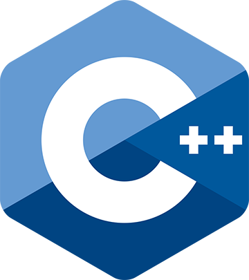
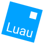

# My Portfolio

## Welcome to my portfolio

***

### Projects

**Roblox**\
**Eldoria** - [[GitHub Repo](https://github.com/averyark/eldoria)] [[Game Place](https://www.roblox.com/games/13812030151/Development-Playground)]

***

### Journal

My history spans beyond a decade. I was 7 when I was first introduced into coding in my primary school's computer classes, I remember the concept of coding sounds so cool to me when I was a kid, it inspired me. Back then at my school there were special extra classes in my, I went home to urge my family to sign me up to basically every class that involved coding and enginering.

The first classes I got into was about a drag and drop like visual coding language called Scratch, I also got into lego robotics building and programming. It was amazing, I was so excited for these classes everyday.

     
     
     

