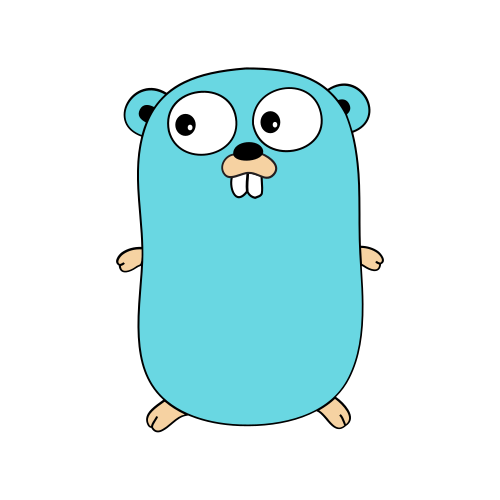
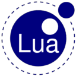
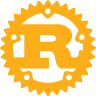

## Welcome to my portfolio

👋 Hi, I'm Avery (not my real name). 19 years old and coded since 7, passion is the drive. Thank you so much for visiting. Within this timeframe, I learnt how to code in several languages: Luau, Lua, Python, Go, Rust, C++ and C.

***

     
     
     
     
     
     
     

***

### Projects
Developments I was involved in. Just for reference, this list does not reflect every projects that I'm involved in due to various reasons.

### Roblox
This is where I gathered many of the crucial experience that would start my career. In Roblox, Lua or Luau is used as the primary language. Some are not public.

***

- ✨ **Eldoria** - [[GitHub Repo](https://github.com/averyark/eldoria)] [[Game Place](https://www.roblox.com/games/13812030151)]
- ✨ **Vibe Game Franchise** - [[Game Place 1](https://www.roblox.com/games/8588385392)] [[Game Place 2](https://www.roblox.com/games/5368012560)] [[Game Place 2](https://www.roblox.com/games/5727050550)]
- ✨ **Piece Battleground** - [[GitHub Repo](https://github.com/averyark/piece-battleground)] [[Game Place](https://www.roblox.com/games/13763068369)]
- ✨ **Singular Point** - [[GitHub Repo](https://github.com/averyark/singular-point)] [[Game Place](https://www.roblox.com/games/15922584652)]

***

### Journal

My history spans beyond a decade. I was 7 when I was first introduced into coding in my primary school's computer classes, I remember the concept of coding sounds so cool to me when I was a kid, it inspired me. Back then at my school there were special extra classes in my, I went home to urge my family to sign me up to basically every class that involved coding and enginering.

The first classes I got into was about a drag and drop like visual coding language called Scratch, I also got into lego robotics building and programming. It was amazing, I was so excited for these classes everyday.